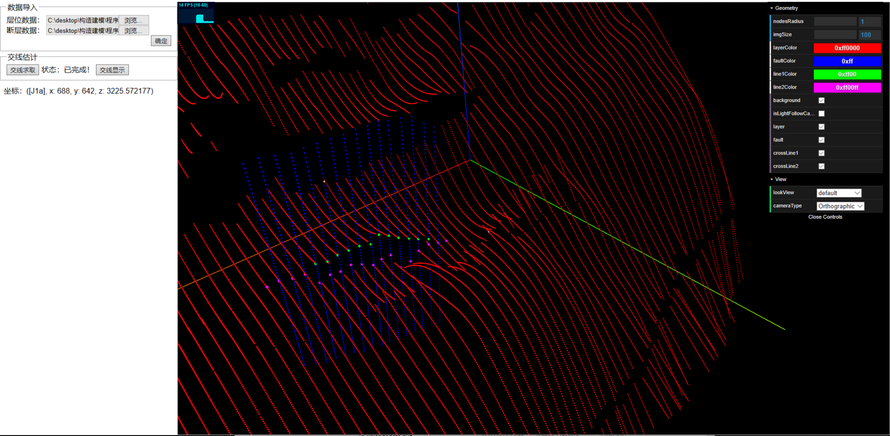

# TreeJsVis

> Some experiments by three.js

[DEMO: 层次网络](https://shuang13.github.io/TreeJsVis/dist/index.html#/Tree)


[DEMO: 岛屿淹没](https://shuang13.github.io/TreeJsVis/dist/index.html#/Mountain)


[DEMO: 地质层位建模](https://shuang13.github.io/TreeJsVis/dist/index.html#/Layer)


[DEMO: 断层交线估计](https://shuang13.github.io/TreeJsVis/dist/index.html#/Intersection)




[DEMO: 地质块体十字截面](https://shuang13.github.io/TreeJsVis/dist/index.html#/Seismic)


# Requirements

- [Vue.js](https://github.com/vuejs/vue) `^2.5.2`
- [three](https://github.com/mrdoob/three.js) `^0.115.0`

## Build Setup

``` bash
# install dependencies
npm install

# serve with hot reload at localhost:8080
npm run dev

# build for production with minification
npm run build
```

# License

[The MIT License](http://opensource.org/licenses/MIT)